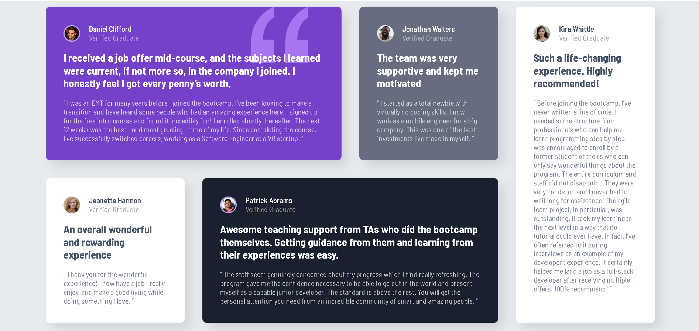

# Frontend Mentor - Testimonials Grid Section Solution

This is a solution to the [Testimonials grid section challenge on Frontend Mentor](https://www.frontendmentor.io/challenges/testimonials-grid-section-Nnw6J7Un7). Frontend Mentor challenges help you improve your coding skills by building realistic projects.

## Table of Contents

- [Overview](#overview)
  - [The Challenge](#the-challenge)
  - [Screenshot](#screenshot)
  - [Links](#links)
- [My Process](#my-process)
  - [Built With](#built-with)
  - [What I Learned](#what-i-learned)
  - [Continued Development](#continued-development)
- [Author](#author)

## Overview

### The Challenge

Users should be able to:
- View the optimal layout for the site depending on their device's screen size

### Screenshot

 


### Links

- **Solution URL:** [Add solution URL here](https://github.com/your-username/your-repo-name)
- **Live Site URL:** [Add live site URL here](https://your-project-name.netlify.app)

## My Process

### Built With

- Semantic HTML5 markup
- CSS custom properties
- Flexbox
- CSS Grid
- Mobile-first workflow

### What I Learned

This was a great project for practicing advanced CSS Grid. The most interesting part was creating the complex desktop layout using `grid-template-areas` and making items span multiple columns and rows.

A key takeaway was learning how to correctly use `grid-template-columns` to create a stable grid foundation before placing items with `grid-area`.

```css
.big-container {
    display: grid;
    grid-template-columns: repeat(4, 1fr);
    grid-template-areas:
        "one one two three"
        "four five five three";
}
.first {
    grid-area: one;
}

Continued Development
In the future, I want to continue focusing on more complex CSS layouts and will start incorporating JavaScript to make components more interactive.
Author
Name - Selehadin Nasir
Frontend Mentor - @SelahNs
Portfolio - https://golden-maamoul-4de0cc.netlify.app/